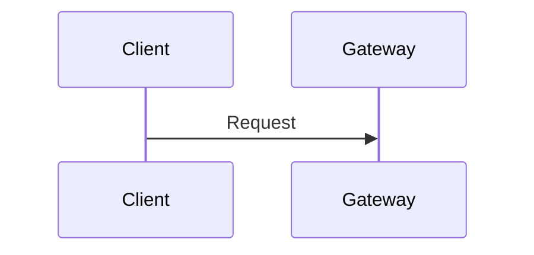

> **TL;DR:** 

## The Security Problem & Threat Model

## Reference Architecture

```mermaid
sequenceDiagram
    Client->>Gateway: Request
```

## Step-by-Step Implementation

## Common Misconfigurations to Avoid

## Production Pre-Flight Checklist
- [ ]